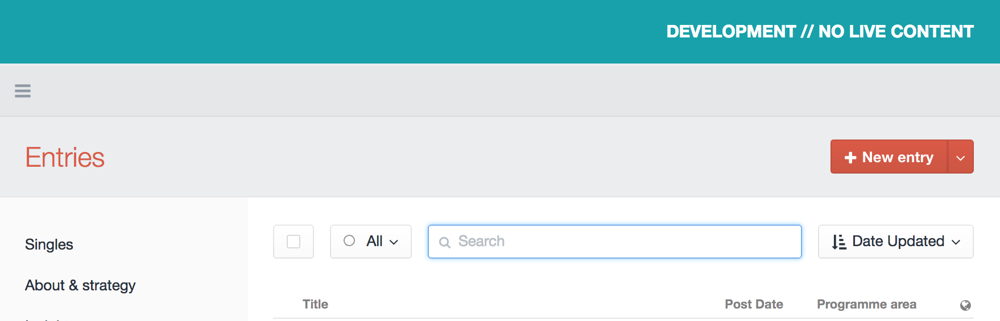
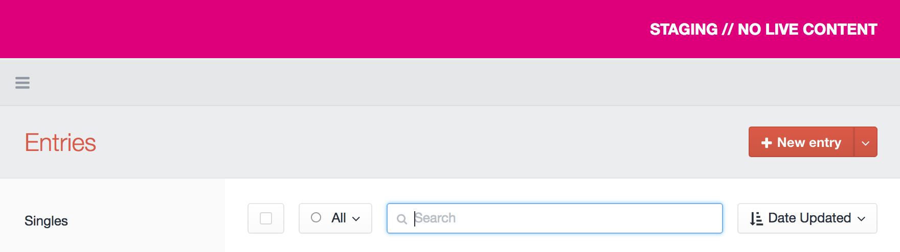

# Environment Label

_Nice coloured labels to help distinguish your CraftCMS environments ...so you don't forget where you are, and do something stupid._

by [Tom Davies](http://madebykind.com/) and [Michael Rog](https://topshelfcraft.com)


### TL;DR.

The _Environment Label_ plugin adds a nice coloured banner to your CraftCMS control panel so you'll never forget what environment you're using.

The colors and text of the environment label are configurable via the plugin config file.


development:



staging:


* * *


### Installation

Drop the `environmentlabel` directory into `craft/plugins`, visit the _Settings_ page of the CP, and click to _Install_ the Environment Variable plugin.

### Config

You can configure the colour and text of the environment label using the plugin config file.

Just add an `environmentlabel.php` file to your `craft/config` directory, and copy in the default plugin config:


```php
<?php

return array(

	'showLabel' => true,
	'label' => CRAFT_ENVIRONMENT,
	'prefix' => null,
	'suffix' => null,
	'labelColor' => '#cc5643',
	'textColor' => '#ffffff',

);
```

By default, the environment label will pull in the value of Craft's `CRAFT_ENVIRONMENT` constant, which is set to the current hostname unless you override it.

_(In other words, out of the box, you get a red banner with white text that alerts you to the current hostname.)_

The plugin config can use Craft's [Multi-Environment Config](https://craftcms.com/docs/multi-environment-configs) syntax, which allows you to tweak the appearance and text of the environment label for each installation.

For example, your `environmentlabel.php` config file might use environment variables set by the server:

```php
<?php

return array(

	'*' => array(
		'label' => getenv('CRAFT_ENV_LABEL'),
		'suffix' => " // NO LIVE CONTENT",
	),

	'myProductionDomain.com' => array(
		'showLabel' => false,
	),

	'.dev' => array(
		'labelColor' => '#337799',
	)

);
```

_(We highly recommend using [dotenv](https://github.com/vlucas/phpdotenv) to store and deploy environment variables on your server. It'll change your life, just don't expose your db credentials in there...)_

### Template variables


```twig

{{ craft.enviromentLabel.showLabel }}
{{ craft.enviromentLabel.label }}
{{ craft.enviromentLabel.prefix }}
{{ craft.enviromentLabel.suffix }}
{{ craft.enviromentLabel.labelColor }}
{{ craft.enviromentLabel.textColor }}
{{ craft.enviromentLabel.renderedTemplate }}

```


**DEPRECATED** _Environment Label_ also makes its data available via a Twig template global variable (`environmentLabel`), but this is deprecated as of the `3.0` release. Use `craft.environmentLabel` instead.

### JavaScript globals

_Environment Label_ makes the current CRAFT_ENVIRONMENT available as a JS global on each authenticated CP page:

```js
window.CRAFT_ENVIRONMENT
```

### What are the system requirements?

Craft 2.5+ and PHP 5.4+


### Contributing / I found a bug.

Please open a GitHub Issue, submit a PR to the `develop` branch, or just email Tom.


* * *

### Changelog

#### 3.0

You should be good to use the same API with a few minor changes, but things have changed a fair bit under the hood:

- Refactored label output to use a template like it should always have done
- Clean up code to better match the current [Craft coding standards](https://github.com/pixelandtonic/CodingStandards/blob/master/standards/PHP.md)
- FEATURE template is now completely customisable, can be either a path to a plugin template, or a template string (use a HEREDOC or similar). Go crazy people.
- FEATURE added `craft.environmentLabel` template variable
- FEATURE `craft()->environmentLabel->getRenderedTemplate()` which is available in templates via `craft.environmentLabel.renderedTemplate`, should you wish to output the label in your front end templates
- DEPRECATED `EnvironmentLabelTwigExtension
`, use the new `craft.environmentLabel` template variable instead. Twig extension will be removed in next major release
- REMOVED `window.CRAFT_ENVIRONMENT_LABEL` JS var as label is now more than just a single line string, and I'm pretty sure this wasn't really used.
- REMOVED `craft()->environmentLabel->getFullText()` in favour of `craft()->environmentLabel->getRenderedTemplate()`


#### 2.1

Added support for ShowLabel value to be exposed at the front-end template level.

#### 2.0

Refactor thanks to @michaelrog

#### 1.0

Initial release

* * *

#### Contributors:

  - Plugin development: [Michael Rog](http://michaelrog.com) / @michaelrog
  - Plugin development: [Tom Davies](https://github.com/tomdavies) / @metadaptive
  - Plugin development: [Joel Bradbury](https://github.com/joelbradbury) / @joelbradbury
  - Idea for custom template feature: [Andrew Welch](https://github.com/nystudio107) @nystudio107

  - Icon: [NAS](http://nasztu.com/), via [The Noun Project](https://thenounproject.com/search/?q=label&i=28588)